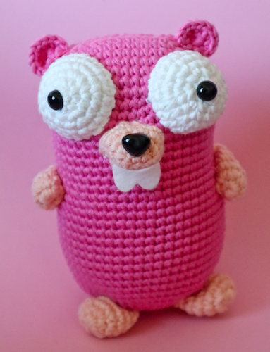
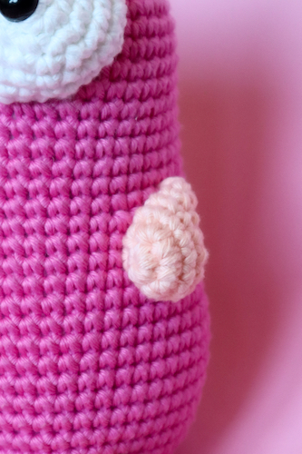
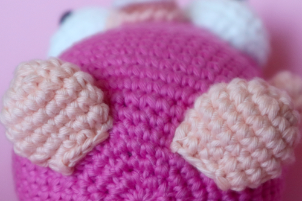
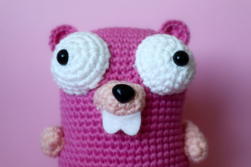
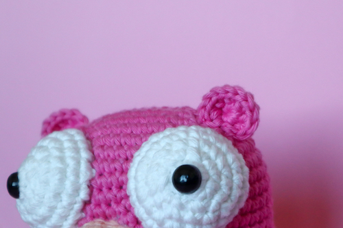

 This work is licensed under a <a rel="license" href="http://creativecommons.org/licenses/by-nc/4.0/">Creative Commons Attribution-NonCommercial 4.0 International License</a>.

> #### Hello community, how are you doing?
> I am learning the language Go, and I find Gopher to be very charismatic.  
So I decided to make this Gopher using the Japanese technique called amigurumi to crochet this version.  
I am sharing the pattern here so that you too can make beautiful Gophers.  
Feel free to write to me if you have any questions or suggestions.  
I hope that, like me, you will like the idea and make lots of them.  
Remember to send me pictures, I will love to see the Gophers you make.
Have fun!!!

> ## Material  
> Yarn cotton (color of your choice)  
> Crochet hook 2.5mm  
> Polyester fiber to fill  

> ## abreviations  
> st - stitch  
> ch - chain stitch  
> sc - single crochet  
> mr - magic ring  
> inc - increment |  increase  
> dec - decrease  
> (...) (6X) - repeat 6 times  

> ## Description:  
> ###  Body
>
> 1 - Chain 10st - turn - 8sc, 5sc(inc) in the last chain,
>       7sc, 4sc(inc) in the last chain => 24st  
> 2 - 9sc, < 1inc(3x) > turn and repeat 9sc,  < 1inc(3x) > => 30st  
> 3 - 9sc, < 1sc, 1inc(3x) > turn and repeat 9sc, < 1sc, 1inc(3x) >  => 36st  
> 4 - 9sc, < 2sc, 1inc(3x) >, turn and repeat 9sc, < 2sc, 1inc(3x) > => 42st  
> 5 - 9sc, < 3sc, 1inc(3x) >, turn and repeat 9sc, < 3sc, 1inc(3x) > => 48st  
> 6 - 18 ( repeat 13 rounds)  => 48st  
> 19 - < 7sc, 1inc(6x) >  => 54st  
> 20 - 33 ( repeat 14 rounds)  => 54st  
> 34 - < 7sc, 1dec(6x) >  => 48st  
> 35 - < 6sc, 1dec(6x) >  => 42st  
> 36 - < 5sc, 1dec(6x) >  => 36st  
> 37 - < 4sc, 1dec(6x) >  => 30st  
> 38 - < 3sc, 1dec(6x) >  => 24st  
> 39 - < 2sc, 1dec(6x) >  => 18st    !!!! Remember to fill with the Polyester fiber before finishing the Gopher! :) 
> 40 - < 1sc, 1dec(6x) > => 18st  
> 41 - < 1dec(6x)  => Finished  

 
 

> ###  Arms (2x)
> 1 - mr (6st) => 6st  
> 2 - 1inc(6x) => 12st  
> 3 - 4 ( repeat 2 rounds)  => 12st  
> 5 - < 1dec(3x), 6sc > => 9st  
> 6 - 1 round => 9st     

 
 

> ###  Feet (2x)
> 1 - mr (6st) => 6st  
> 2 - 1inc(6x) => 12st  
> 3 - < 1sc, 1inc(6x) > => 18st  
> 4 - < 2sc, 1inc(6x) > => 24st  
> 5 - 6 ( repeat 2 rounds)  => 24st  
> 7 - < 2sc, 1dec(6x) >  => 18st  

 
 

> ###  Eyes (2x)
> 1 - mr (6st) => 6st  
> 2 - 1inc(6x) => 12st  
> 3 - < 1sc, 1inc(6x) > => 18st  
> 4 - < 2sc, 1inc(6x) > => 24st  

 
 

> ###  Ears (2x)
> 1 - mr (6st) => 6st  
> 2 - 1inc(6x) => 12st  

> ###  Nose
> 1 - Chain 4st - turn - 2sc, 3sc(inc) in the last chain,
>       1sc, 3sc(inc) in the last st => 9st  
> 2 - 3sc, < 1inc(3x) > 4sc,  < 1inc(2x) > => 12st  
> 3 - 4 ( repeat 2 rounds)  => 12st  

> The finished Gopher is 15cm tall.

 This work is licensed under a <a rel="license" href="http://creativecommons.org/licenses/by-nc/4.0/">Creative Commons Attribution-NonCommercial 4.0 International License</a>.
